# About application service migration

The application service migration tool allows you to select virtual servers currently running on your BIG-IP devices to convert into Application Services (AS3 declaration) and deploy them to BIG-IP Next instances. This version of BIG-IP Next Central Manager supports migration from a UCS for application delivery and control services for HTTP and HTTPS applications services.

The migrated application services are added to BIG-IP Next Central Manager and you can edit the AS3 declaration for later deployment.

In addition, during the pre-deployment stage of application migration you can install shared objects, such as, iRules, SSL certificates, and WAF or Access policies to BIG-IP Next Central Manger. Once installed, these objects can be attached to application services and modified on BIG-IP Next Central Manager. Modifying objects will be automatically updated on attached applications services.

For a full overview of application migration, see [Migrate BIG-IP application configurations onto BIG-IP Next Central Manager](https://clouddocs.f5.com/bigip-next/latest/use_cm/cm_device_migration_overview.html)

## Application migration and deployment process

Migrate your BIG-IP applications (version 12.1 or later) and their application management services into BIG-IP Next. From BIG-IP Next Central Manager, you can use each managed BIG-IP device's UCS file to migrate the device's application services and deploy to a BIG-IP Next instance.

Bulk operations are not required, as you can select specific applications for migration. You can perform this process multiple times to ensure high-priority applications are migrated first. An increased number of applications selected per migration will impact the time required to complete the migration process.

The migration wizard provides a 3-step process to migrate and deploy your application services to a BIG-IP Next instance:

- Upload the UCS file from your BIG-IP device and select how to group the virtual servers in their application services.
- View application services and manage their virtual server configuration. Select application services for migration.
- Select the deployment destination, save application service as draft, or save imported objects (certificates, iRules, WAF and Access policies) to BIG-IP Next Central Manager.

> Note: When you save an application service as a draft, you can make changes to the AS3 declaration. In some cases the configuration of the application service or virtual server is not supported by BIG-IP Next. You can make these changes and later deploy the application service with the supported changes.

After you deploy your migrated application services, you can view a summary of the migration and deployment process.

### Lab Environment

This lab has only one resource, "BIG-IP Next Central Manager." External access to the environment is provided from F5 as a UDF Course or internally as the UDF Blueprint "BIG-IP Next Central Manager."

> Note: Current Version is **20.2.1-0.2.16**


Access to the BIG-IP Next Central Manager is located under **ACCESS**. This lab only needs **GUI** access.


Credentials for BIG-IP Next Central Manager are located under **DETAILS**

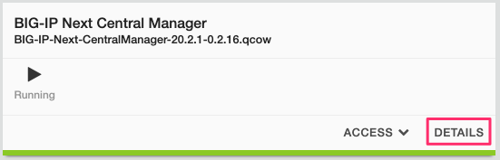

### Lab

1. Access the **GUI** of BIG-IP Next Central Manager
   - Credentials `admin`/`yBQ^K0q2_0OOR64`
   - 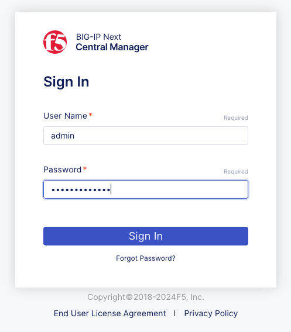

2. Access **Manage Applications**
   - 

3. Since this is our first application, imported or created, there is nothing to show. We will make our first application from a UCS file of a BIG-IP.
   - 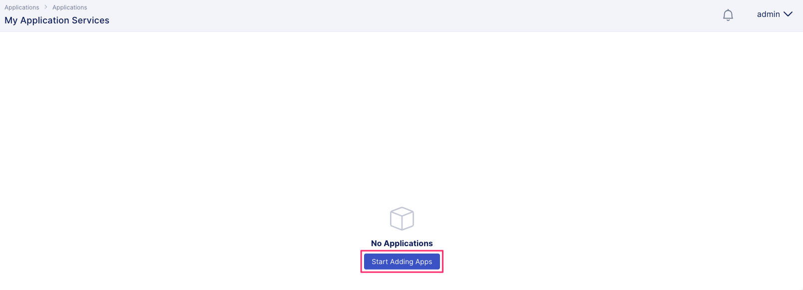

4. Create a **New Migration** for our application(s)
   - 

5. Sessions are a returnable object; a date nomenclature might be easier as a practice, but anything can be used and returned, too.
   - 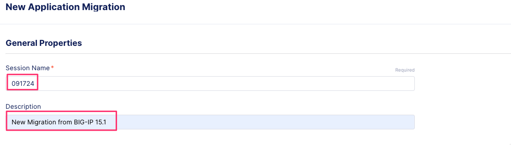

6. Download the UCS for demo BIG-IP migration.
   - Link: [UCS GitHub location](https://github.com/f5devcentral/F5-Channel-Partner-Enablement-Workshop/blob/main/Events/%20BIG-IP-Next-Central-Manager-Migration-Assistant/files/BIG-IP-15.1.ucs)
   - 

7. Upload UCS into BIG-IP Central Manager migration.
   - Drag the UCS file into the migration page
   - 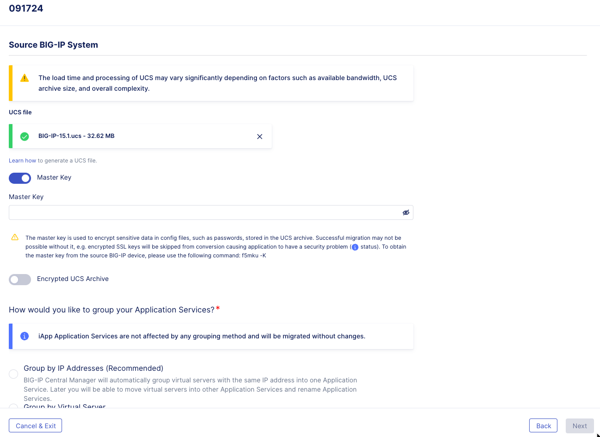

8. Master Key Settings.
   - The master key for the UCS BIG-IP has been exported so the import can contain all resources. With a master key, you can import certificates, keys, and other system-level security resources. More information about master keys [Working with master keys](https://techdocs.f5.com/en-us/bigip-13-1-0/big-ip-secure-vault-administration/working-with-master-keys.htmls).
   - Master Key: ```cgGaYTNid4Gvqdelf/85cw==```
   - 

9. Encrypted UCS.
   - As a best practice the UCS file was encrypted from the original BIG-IP with a key. In this situation, you need the passphrase to open the UCS; the UCS passphrase is the same as the master key. More information about UCS archives [Overview of UCS archives](https://my.f5.com/manage/s/article/K4423).
   - UCS Passphrase: ```cgGaYTNid4Gvqdelf/85cw==```
   - 

10. Application grouping. Many applications require more than one BIG-IP Virtual. Within BIG-IP Next, you can logically group applications for a better representation of application resources. Grouping by Addresses is a recommended starting place; this will capture redirect virtuals or multi-port applications.
   - > Note: Applications can be moved between groups later
   - 

11. Finalize import
   - 
   - 
   - 
   - 

12. After a successful import, applications can be selectively viewed for success rate, AS3 conversion, and grouping.
   - 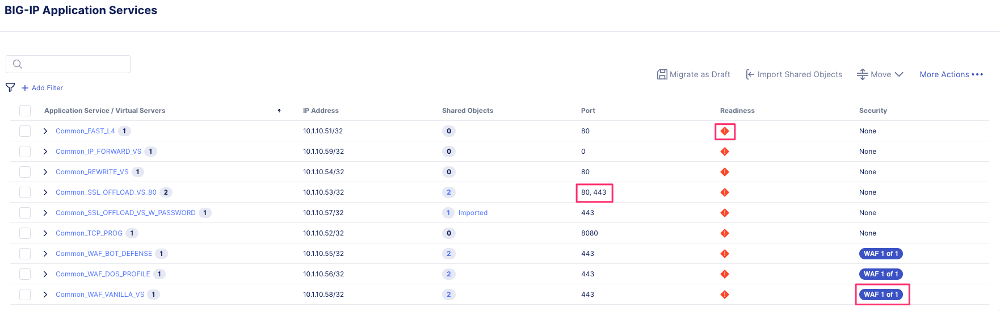

13. BIG-IP Next Application Analyze.
   - BIG-IP Next utilizes AS3 as the declarative delivery engine. However, there are feature differences between BIG-IP TMOS and BIG-IP Next. Central Manager will highlight a color code of the lowest posible migration score. Through the built in IDE for analysis these differences are called out or automatically make removals for unsupported objects.
   - Examine Application ```Common_IP_FORWARD_VS``` Status
   - 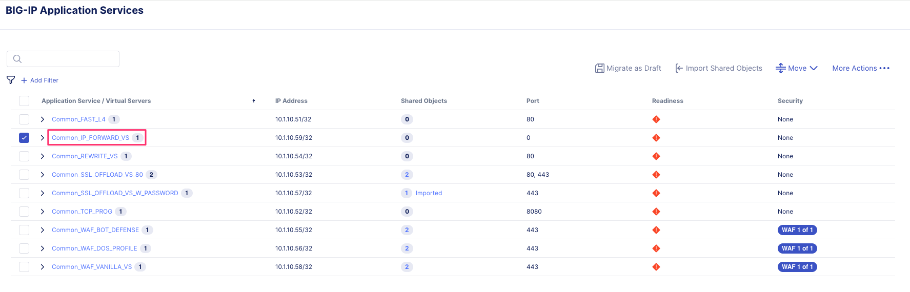
   - Highlighted Red are application services currently not supported on BIG-IP Next. In this example Forward Proxy virtual servers are not yet available.
   - 
   - Highlighted Green are application services that are supported features
   - 

14. BIG-IP Next Application Import.
   Importing an application requires very few steps. The process will cover importing objects the application might need (certificates/keys and security policies), converting to AS3, and then allowing you to deploy to an instance or save as a draft.
   - > Note: This environment does not have any managed BIG-IP Next instances so that all applications will go to draft
   - Import Application ```Common_WAF_VANILLA_VS```
   - 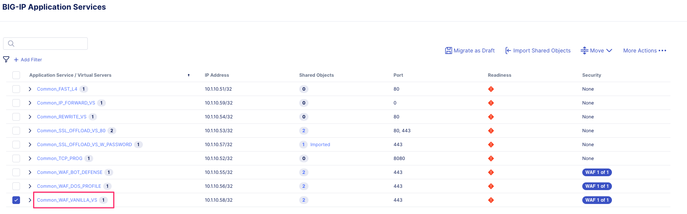
   - This virtual requires importing a certificate/key and a WAF policy. Importing these into BIG-IP Next Central Manager will make them available for all applications from a central standpoint.
   - > Note: The import of these objects is reliant on the Master Key export from the source BIG-IP TMOS instance
   - 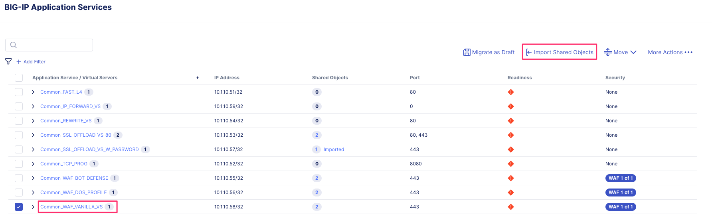
   - Import the certificate/key to BIG-IP Next Central Manager
   - 
   - Review and approve the Virtuals to be migrated
   - 
   -    
   - Deploy application ```Common_WAF_VANILLA_VS``` into draft.
   - > Note: Managed instances available for deployments would also be shown on the drop-down

15. Application Dashboard
   As applications are created, the BIG-IP Next Central Manager visualizes them on the Application Dashboard. This will give users a holistic view of deployments and the health of deployed applications.
   - 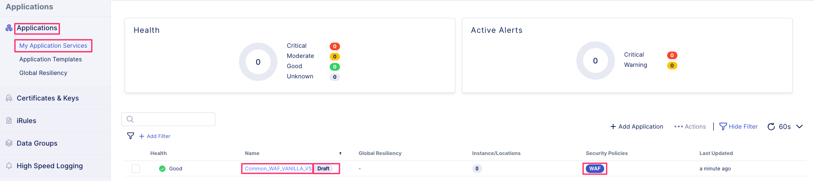

16. Application Modification
   - Application ```Common_WAF_VANILLA_VS``` has been deployed into a draft state. BIG-IP Next Central Manager will now allow modification to the AS3 declaration and review.
   - 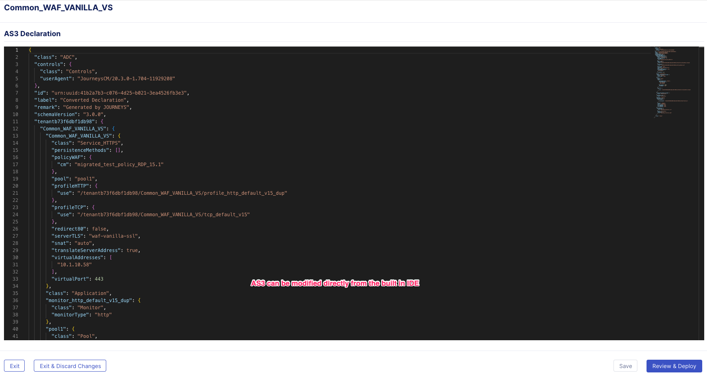

17. Imported Application Resources Certificate and Keys
   - Certificates and Keys are located as a shared resource for applications. The import of application```Common_WAF_VANILLA_VS``` brought this certificate/key pair under the control of BIG-IP Next Central Manager
   - 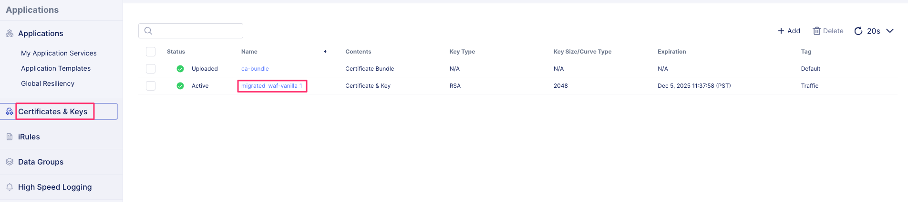

18. Imported Application Resources WAF Policies
   - WAF policies are a Security resource
   - 
   Other security resources are available in BIG-IP Next (Access, SSL Orchestrator). The WAF section contains WAF policies and Live Updates for Signatures, Bots, and Threat Campaigns.
   - 
   - Policy management is located in the policy itself. Policies in BIG-IP Next are managed as a Declarative WAF policy, which has been available from BIG-IP TMOS 15+. Similar to how the application configuration was converted to AS3, the WAF policy was converted to Declarative WAF. More information on [F5 Declarative WAF](https://techdocs.f5.com/en-us/bigip-15-1-0/big-ip-declarative-security-policy/declarative-policy-getting-started.html)
   - > Note: Declarative WAF policies can be moved between other F5 portfolio products, such as NGINX and F5 Distributed Cloud.
   - BIG-IP Next WAF includes both IP Intelligence and Threat Campaigns, as a better security practice these addtional layers should be added.
   - 

### Lab Complete
