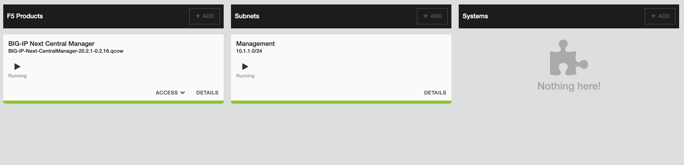
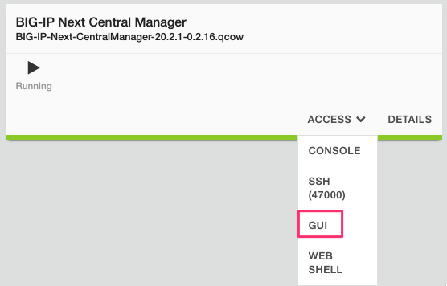
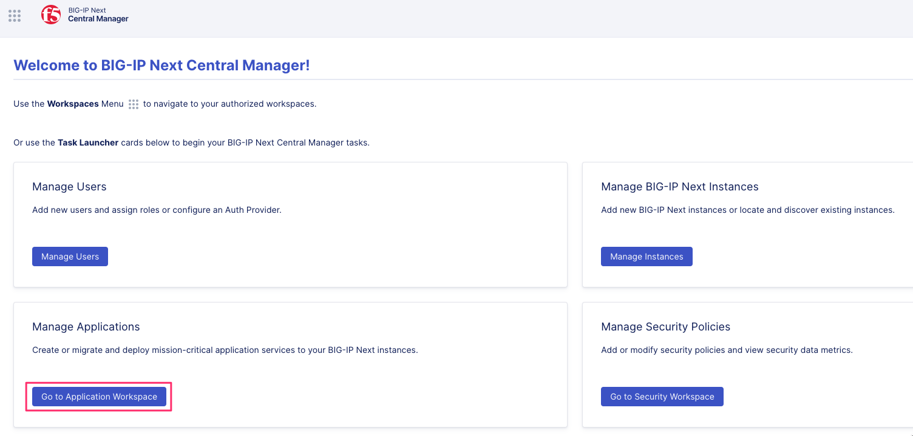
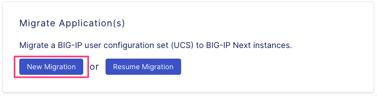

# About application service migration

The application service migration tool allows you to select virtual servers currently running on your BIG-IP devices to convert into Application Services (AS3 declaration) and deploy them to BIG-IP Next instances . This version of BIG-IP Next Central Manager supports migration from a UCS for application delivery and control services for HTTP and HTTPS applications services.

The migrated application services are added to BIG-IP Next Central Manager and you can edit the AS3 declaration for later deployment.

In addition, during the pre-deployment stage of application migration you can install shared objects, such as, iRules, SSL certificates, and WAF or Access policies to BIG-IP Next Central Manger. Once installed, these objects can be attached to application services and modified on BIG-IP Next Central Manager. Modifying objects will be automatically updated on attached applications services.

For a full overview of application migration, see [Migrate BIG-IP application configurations onto BIG-IP Next Central Manager](https://clouddocs.f5.com/bigip-next/latest/use_cm/cm_device_migration_overview.html)

## Application migration and deployment process

Migrate your BIG-IP applications (version 12.1 or later) and their application management services into BIG-IP Next. From BIG-IP Next Central Manager, you can use each managed BIG-IP device’s UCS file to migrate the device’s application services and deploy to a BIG-IP Next instance.

Bulk operations are not required, as you can select specific applications for migration. You can perform this process multiple times to ensure high priority applications are migrated first. An increased number of applications selected per migration will impact the time required to complete the migration process.

The migration wizard provides a 3-step process to migrate and deploy your application services to a BIG-IP Next instance:

- Upload the UCS file from your BIG-IP device and select how to group the virtual servers in their application services.
- View application services and manage their virtual server configuration. Select application services for migration.
- Select the deployment destination, save application service as draft, or save imported objects (certificates, iRules, WAF and Access policies) to BIG-IP Next Central Manager.

> Note: When you save an application service as a draft, you can make changes to the AS3 declaration. In some cases the configuration of the application service or virtual server is not supported by BIG-IP Next. You can make these changes and later deploy the application service with the supported changes.

After you deploy your migrated application services, you can view a summary of the migration and deployment process.

### Lab Environment

This lab has only one object, "BIG-IP Next Central Manager". External access to the environment is provided from F5 as a UDF Course or internally as the UDF Blueprint "BIG-IP Next Central Manager".

> Note: Current Version is **20.2.1-0.2.16**

Access to the BIG-IP Next Central Manager is located under **ACCESS** this lab only needs **GUI** access

Credentials for BIG-IP Next Central Manager are located under **DETAILS**

### Lab

1. Access the **GUI** of BIG-IP Next Central Manager
   - Credentials `admin`/`26rO!KeS3`
   - 

2. Access **Manage Applications**
   - 

3. Since this is our first application, imported or created, there is nothing to show. We will create our first application from a UCS file of a BIG-IP.
   - 

4. Create a **New Migration** for our application(s)
   - 

5. Sessions are a returnable object; as a practice, a date nomenclature might be easier, but anything can be used and returned too.
   - 