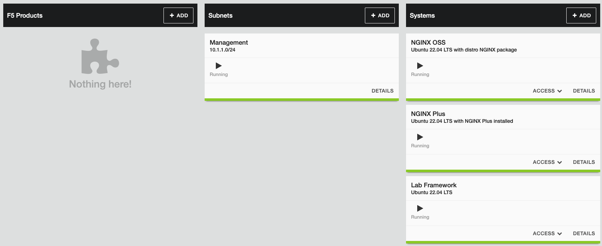
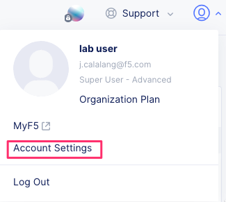
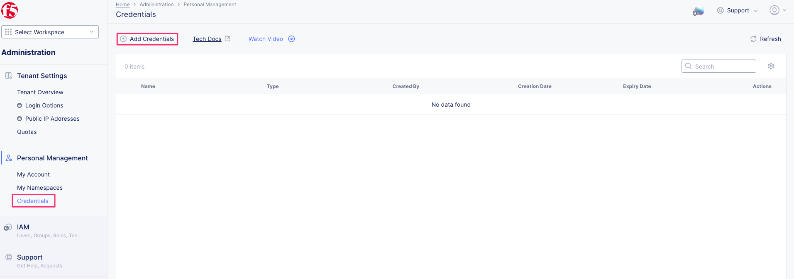
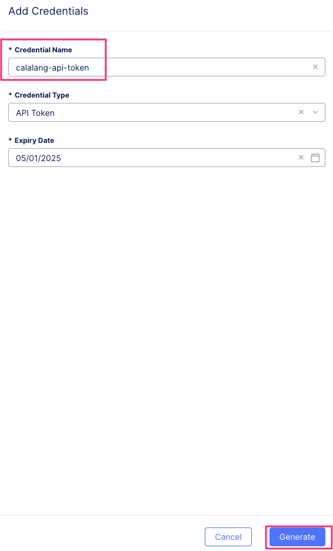
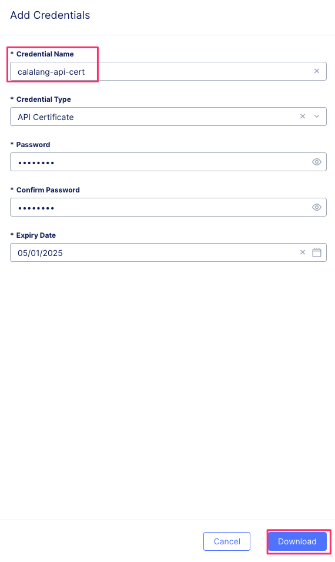
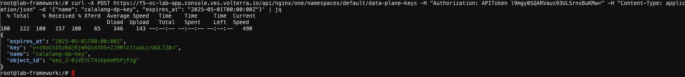

# About NGINX One

The F5 NGINX One Console makes it easy to manage NGINX instances across locations and environments. The console lets you monitor and control your NGINX fleet from one place—you can check configurations, track performance metrics, identify security vulnerabilities, manage SSL certificates, and more.

NGINX One offers the following key benefits:

- Centralized control: Manage all your NGINX instances from a single console.
- Enhanced monitoring and risk detection: Automatically detect critical vulnerabilities (CVEs), verify SSL certificate statuses, and identify security issues in NGINX configurations.
- Performance optimization: Track your NGINX versions and receive recommendations for tuning your configurations for better performance.
- Graphical Metrics Display: Access a dashboard that shows key metrics for your NGINX instances, including instance availability, version distribution, system health, and utilization trends.
- Real-time alerts: Receive alerts about critical issues.

### Lab Environment

This lab environment contains five parts. Students will not use all the included lab components.

- NGINX Open Source Server
- NGINX Plus Server
- Docker Server (Lab Framework)
- AWS Access
- F5 Distributed Cloud Access



## F5 Distributed Cloud API

Generate an F5 Distributed Cloud API token or certificate. In the following examples, either Token or Cert will work; however, for security reasons, users might choose one option over the other. 

1. You can authenticate API requests in two ways: using an API Token or an API Certificate. Below are examples of how to do this with curl.

    - API Token Authentication: Uses a header including the token to access the API
    - API Certificate Authentication: Uses a client certificate and password in the request to access the API

> Note: The user's role determines the permissions associated with the API token.

Navigate to your F5 Distributed Cloud account credentials.

> Note: Save the token key and/or the certificate password someplace to be used throughout the lab.



Create a new API credential type



Generate API Token



Generate API Certificate




Test using an API token to authenticate an F5 Distributed Cloud API request. This example request lists tenant namespaces for organization plans:

```
curl https://f5-xc-lab-app.console.ves.volterra.io/api/web/namespaces -H "Authorization: APIToken <API TOKEN>" 
```

Test using an API Certificate to authenticate an F5 Distributed Cloud API request. This example request lists tenant namespaces for organization plans:

```
curl https://f5-xc-lab-app.console.ves.volterra.io/api/web/namespaces --cert-type P12 --cert <api-creds>:<password>
```

Full F5 Distributed Cloud API Reference Guide: https://docs.cloud.f5.com/docs-v2/api


### NGINX One API

NGINX One API Reference Guide: https://docs.nginx.com/nginx-one/api/api-reference-guide/

1. Create a data plane key for NGINX instances.

The DataPlaneKey object represents a secure token required to establish a connection between your NGINX instances and NGINX One. As a fundamental security measure, the data plane key ensures that only trusted NGINX instances can register and communicate with NGINX One.

Data plane keys expire after one year. This is the default setting if you don't specify an expiration time when you create a key. If necessary, you can update the data plane key later to extend its expiration.

Revoking a data plane key will disconnect the associated NGINX instances from NGINX One.

> Note: Data plane keys are not saved and are displayed only once when you generate them. You should save this key in a secure location for future reference.

Using either the API token or the API certifcate create a new NGINX One data plane key.

```
curl -X POST https://f5-xc-lab-app.console.ves.volterra.io/api/nginx/one/namespaces/default/data-plane-keys -H "Authorization: APIToken <API TOKEN>" -H "Content-Type: application/json" -d '{"name": "<DATA-PLANE-KEY-NAME>", "expires_at": "2025-05-01T00:00:00Z"}'
```

OR

```
curl -X POST https://f5-xc-lab-app.console.ves.volterra.io/api/nginx/one/namespaces/default/data-plane-keys --cert-type P12 --cert <api-creds>:<password> -H "Content-Type: application/json" -d '{"name": "<DATA-PLANE-KEY-NAME>", "expires_at": "2025-05-01T00:00:00Z"}'
```

Example output:



### Lab Complete