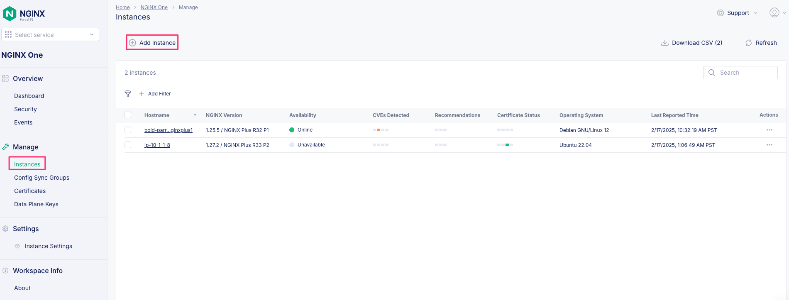
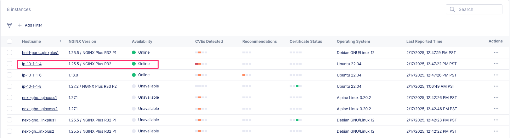

# About NGINX One

The F5 NGINX One Console makes it easy to manage NGINX instances across locations and environments. The console lets you monitor and control your NGINX fleet from one place—you can check configurations, track performance metrics, identify security vulnerabilities, manage SSL certificates, and more.

NGINX One offers the following key benefits:

- Centralized control: Manage all your NGINX instances from a single console.
- Enhanced monitoring and risk detection: Automatically detect critical vulnerabilities (CVEs), verify SSL certificate statuses, and identify security issues in NGINX configurations.
- Performance optimization: Track your NGINX versions and receive recommendations for tuning your configurations for better performance.
- Graphical Metrics Display: Access a dashboard that shows key metrics for your NGINX instances, including instance availability, version distribution, system health, and utilization trends.
- Real-time alerts: Receive alerts about critical issues.

### Lab Environment

This lab environment contains five parts. Students will not use all the included lab components.

- NGINX Open Source Server
- NGINX Plus Server
- Docker Server (Lab Framework)
- AWS Access
- F5 Distributed Cloud Access


## F5 Distributed Cloud API

Generate an F5 Distributed Cloud API token or certificate. In the following examples, either Token or Cert will work; however, users might choose one option for security reasons. 

1. You can authenticate API requests in two ways: using an API Token or an API Certificate. Below are examples of how to do this with curl.

    - API Token Authentication: Uses a header including the token to access the API
    - API Certificate Authentication: Uses a client certificate and password in the request to access the API

> Note: The user's role determines the permissions associated with the API token.

Navigate to your F5 Distributed Cloud account credentials.

> Note: Save the token key and/or the certificate password someplace to be used throughout the lab.


Create a new API credential type


Generate API Token


Generate API Certificate


Test using an API token to authenticate an F5 Distributed Cloud API request. This example request lists tenant namespaces for organization plans:

```
curl https://f5-xc-lab-app.console.ves.volterra.io/api/web/namespaces -H "Authorization: APIToken <API TOKEN>" 
```

Test using an API Certificate to authenticate an F5 Distributed Cloud API request. This example request lists tenant namespaces for organization plans:

```
curl https://f5-xc-lab-app.console.ves.volterra.io/api/web/namespaces --cert-type P12 --cert <api-creds>:<password>
```

Complete F5 Distributed Cloud API Reference Guide: https://docs.cloud.f5.com/docs-v2/api


### NGINX One API

NGINX One API Reference Guide: https://docs.nginx.com/nginx-one/api/api-reference-guide/

1. Create a data plane key for NGINX instances.

The DataPlaneKey object represents a secure token required to establish a connection between your NGINX instances and NGINX One. As a fundamental security measure, the data plane key ensures that only trusted NGINX instances can register and communicate with NGINX One.

Data plane keys expire after one year. This is the default setting if you don't specify an expiration time when you create a key. If necessary, you can update the data plane key later to extend its expiration.

Revoking a data plane key will disconnect the associated NGINX instances from NGINX One.

> Note: Data plane keys are not saved and are displayed only once when you generate them. You should save this key in a secure location for future reference.

Create a new NGINX One data plane key using either the API token or the API certificate.

```
curl -X POST https://f5-xc-lab-app.console.ves.volterra.io/api/nginx/one/namespaces/default/data-plane-keys -H "Authorization: APIToken <API TOKEN>" -H "Content-Type: application/json" -d '{"name": "<DATA-PLANE-KEY-NAME>", "expires_at": "2025-05-01T00:00:00Z"}'
```

OR

```
curl -X POST https://f5-xc-lab-app.console.ves.volterra.io/api/nginx/one/namespaces/default/data-plane-keys --cert-type P12 --cert <api-creds>:<password> -H "Content-Type: application/json" -d '{"name": "<DATA-PLANE-KEY-NAME>", "expires_at": "2025-05-01T00:00:00Z"}'
```

Example output:


2. NGINX Agent

The NGINX Agent is the mechanism which creates the communication between NGINX One (or NIM) and the NGINX Services. NGINX Agent runs as a companion process on a system running NGINX. It provides gRPC and REST interfaces for configuration management and metrics collection from the NGINX process and operating system. NGINX Agent enables remote interaction with NGINX using common Linux tools and unlocks the ability to build sophisticated monitoring and control systems that can manage large collections of NGINX instances.

NGINX Agent Overview: https://docs.nginx.com/nginx-agent/overview/


3. Generate instance script for NGINX One

Several different instance types can be added to NGINX One, NGINX Plus, NGINX, Open Source, and NGINX containers. All of these different instance types are available in the lab environment. 

We will use the same method to bind the instances into NGINX One for NGINX Plus and NGINX Open Source. 


Add a new Instance in NGINX One to retrieve the install script. This script can be used repeatedly across many instances. However, keep in mind that if the Data Plane Key used is ever revoked, those instances will lose their connectivity to NGINX One.



Using the Data plane Key created earlier, generate a custom install script. Save this script someplace to be used later.


4. Add NGINX Open Source Instance to NGINX One

Open the Web Shell for the NGINX Open Source Instance


Run the script for adding the NGINX instance into NGINX One

```
curl https://agent.connect.nginx.com/nginx-agent/install | DATA_PLANE_KEY="<DATA-PLANE-KEY>" sh -s -- -y 
```


The NGINX Open Source instance is now connected to NGINX One, and the server name is used in NGINX One.


You can now use NGINX One GUI to see instance information:


5. Add NGINX Plus Instance to NGINX One

Open the Web Shell for the NGINX Plus Instance


Run the script for adding the NGINX instance into NGINX One

```
curl https://agent.connect.nginx.com/nginx-agent/install | DATA_PLANE_KEY="<DATA-PLANE-KEY>" sh -s -- -y 
```


The NGINX Plus instance is now connected to NGINX One, and the server name is used as the name in NGINX One.



You can now use NGINX One console to see instance information:


5. NGINX One instance API

The NGINX One API includes all the same information as the console; we can use the instance endpoint to see bound instances.

```
curl https://f5-xc-lab-app.console.ves.volterra.io/api/nginx/one/namespaces/default/instances -H "Authorization: APIToken <API TOKEN> | jq
```


6. NGINX One Instance ObjectID


### Lab Complete