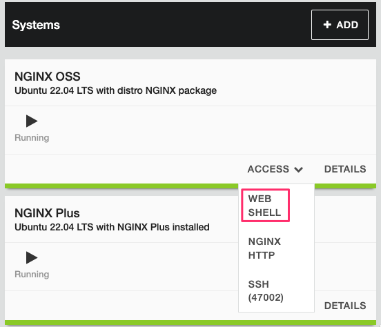

# About NGINX One

The F5 NGINX One Console makes it easy to manage NGINX instances across locations and environments. The console lets you monitor and control your NGINX fleet from one place—you can check configurations, track performance metrics, identify security vulnerabilities, manage SSL certificates, and more.

NGINX One offers the following key benefits:

- Centralized control: Manage all your NGINX instances from a single console.
- Enhanced monitoring and risk detection: Automatically detect critical vulnerabilities (CVEs), verify SSL certificate statuses, and identify security issues in NGINX configurations.
- Performance optimization: Track your NGINX versions and receive recommendations for tuning your configurations for better performance.
- Graphical Metrics Display: Access a dashboard that shows key metrics for your NGINX instances, including instance availability, version distribution, system health, and utilization trends.
- Real-time alerts: Receive alerts about critical issues.

## Lab Environment

This lab environment contains five parts. Students will not use all the included lab components.

### Unless otherwise noted you will do all terminal access through the Web Shell on the Lab Framework Server ###

- NGINX Open Source Server
- NGINX Plus Server
- Docker Server (Lab Framework)
- AWS Access
- F5 Distributed Cloud Access


## F5 Distributed Cloud API

Generate an F5 Distributed Cloud API token or certificate. In the following examples, either Token or Cert will work; however, users might choose one option for security reasons. 

1. You can authenticate API requests in two ways: using an API Token or an API Certificate. Below are examples of how to do this with curl.

    - API Token Authentication: Uses a header including the token to access the API
    - API Certificate Authentication: Uses a client certificate and password in the request to access the API

> Note: The user's role determines the permissions associated with the API token.

Navigate to your F5 Distributed Cloud account credentials.

> Note: Save the token key and/or the certificate password someplace to be used throughout the lab.


Create a new API credential type


Generate API Token


Generate API Certificate


Test using an API token to authenticate an F5 Distributed Cloud API request. This example request lists tenant namespaces for organization plans:

```
curl https://f5-xc-lab-app.console.ves.volterra.io/api/web/namespaces -H "Authorization: APIToken <API TOKEN>" 
```

Test using an API Certificate to authenticate an F5 Distributed Cloud API request. This example request lists tenant namespaces for organization plans:

```
curl https://f5-xc-lab-app.console.ves.volterra.io/api/web/namespaces --cert-type P12 --cert <api-creds>:<password>
```

Complete F5 Distributed Cloud API Reference Guide: https://docs.cloud.f5.com/docs-v2/api


### NGINX One API - Part 1

1. Create a data plane key for NGINX instances.

The DataPlaneKey object represents a secure token required to establish a connection between your NGINX instances and NGINX One. As a fundamental security measure, the data plane key ensures that only trusted NGINX instances can register and communicate with NGINX One.

Data plane keys expire after one year. This is the default setting if you don't specify an expiration time when you create a key. If necessary, you can update the data plane key later to extend its expiration.

Revoking a data plane key will disconnect the associated NGINX instances from NGINX One.

> Note: Data plane keys are not saved and are displayed only once when you generate them. You should save this key in a secure location for future reference.

Create a new NGINX One data plane key using either the API token or the API certificate.

```
curl -X POST https://f5-xc-lab-app.console.ves.volterra.io/api/nginx/one/namespaces/default/data-plane-keys -H "Authorization: APIToken <API TOKEN>" -H "Content-Type: application/json" -d '{"name": "<DATA-PLANE-KEY-NAME>", "expires_at": "2025-05-01T00:00:00Z"}'
```

OR

```
curl -X POST https://f5-xc-lab-app.console.ves.volterra.io/api/nginx/one/namespaces/default/data-plane-keys --cert-type P12 --cert <api-creds>:<password> -H "Content-Type: application/json" -d '{"name": "<DATA-PLANE-KEY-NAME>", "expires_at": "2025-05-01T00:00:00Z"}'
```

Example output:


2. NGINX Agent

The NGINX Agent is the mechanism which creates the communication between NGINX One (or NIM) and the NGINX Services. NGINX Agent runs as a companion process on a system running NGINX. It provides gRPC and REST interfaces for configuration management and metrics collection from the NGINX process and operating system. NGINX Agent enables remote interaction with NGINX using common Linux tools and unlocks the ability to build sophisticated monitoring and control systems that can manage large collections of NGINX instances.

NGINX Agent Overview: https://docs.nginx.com/nginx-agent/overview/


3. Generate instance script for NGINX One

Several instance types can be added to NGINX One, NGINX Plus, NGINX, Open Source, and NGINX containers. All of these different instance types are available in the lab environment. 

We will use the same method to bind the instances into NGINX One for NGINX Plus and NGINX Open Source. 


Add a new Instance in NGINX One to retrieve the install script. This script can be used repeatedly across many instances. However, keep in mind that if the Data Plane Key used is ever revoked, those instances will lose their connectivity to NGINX One.


Using the Data plane Key created earlier, generate a custom install script. Save this script someplace to be used later.


4. Add NGINX Open Source Instance to NGINX One

> Note: In environments where the addresses or hostnames could be the same, you can use the data plane key as a unique identifier to find instances added to the NGINX One console.


Open the Web Shell for the NGINX Open Source Instance



Run the script for adding the NGINX instance into NGINX One

```
curl https://agent.connect.nginx.com/nginx-agent/install | DATA_PLANE_KEY="<DATA-PLANE-KEY>" sh -s -- -y 
```


The NGINX Open Source instance is now connected to NGINX One, and the server name is used in NGINX One.


You can now use NGINX One GUI to see instance information:


5. Add NGINX Plus Instance to NGINX One

Open the Web Shell for the NGINX Plus Instance


Run the script for adding the NGINX instance into NGINX One

```
curl https://agent.connect.nginx.com/nginx-agent/install | DATA_PLANE_KEY="<DATA-PLANE-KEY>" sh -s -- -y 
```


The NGINX Plus instance is now connected to NGINX One, and the server name is used as the name in NGINX One.


You can now use NGINX One console to see instance information:


The NGINX Agent install script is shown as a simple method because our NGINX instances were pre-created. Utilizing a bootstrap mechanism is another way to do the operation more programmatically. Cloud-Init or the "template-file" resource in Terraform containing the installation script will bring instances into the NGINX One console on creation. 

An example of template-file and Terraform are here: 
- https://github.com/jmcalalang/lab/blob/main/nginx/terraform/infrastructure/files/bootstrap-instance-group-azure-instances.sh
- https://github.com/jmcalalang/lab/blob/main/nginx/terraform/infrastructure/nginxInstances.tf (240)

6. NGINX One instance API

The NGINX One API includes all the same information as the console; we can use the instance endpoint to see bound instances.

```
curl https://f5-xc-lab-app.console.ves.volterra.io/api/nginx/one/namespaces/default/instances -H "Authorization: APIToken <API TOKEN> | jq
```


7. NGINX One Instance ObjectID

Each instance of NGINX in NGINX One will be issued a unique identifier: the ObjectID. The NGINX One console uses it to send configuration and retrieve information via the NGINX Agent.


ObjectID can be found within the instance information with the API or console.

API:


Console:


Find and save the NGINX Open Source and NGINX Plus Object IDs for later.

8. Ansible

Install Ansible on the Lab Framework instance.

```
apt install ansible
```

Check Ansible version

```
ansible --version
```


Clone this repository for Ansible Playbooks

```
git clone https://github.com/f5devcentral/F5-Channel-Partner-Enablement-Workshop
```


9. Ansible Setup

Before we can use Ansible to start managing the configuration of our NGINX instances, we need to modify our default file for some variables about our environment. There are many places to store secure variables, but this demonstration shows the easiest path to configuration management with clear variables.

Using whatever Linux editor you choose (examples in vi), open and modify the defaults main.yaml.


```
vi F5-Channel-Partner-Enablement-Workshop/Events/NGINX-One-Automation/files/ansible/configuration/defaults/main.yaml
```

Modify the following four locations for your environment, and save the file

> Note: In this workshop the nginx_one_f5xc_tenant is ```f5-xc-lab-app```

```
# Ansible Variables

nginx_one_f5xc_tenant: ""           <---------- Insert your F5 Distributed Cloud Tenant in quotes
nginx_one_f5xc_api_token : ""       <---------- Insert your F5 Distributed Cloud API Token in quotes

# List of NGINX One Instance IDs
nginx_plus_instances:
 - instance: inst_replace          <---------- Insert your NGINX Plus ObjectID

nginx_os_instances:
 - instance: inst_replace          <---------- Insert your NGINX Open Source ObjectID

# Use Ansible module or skip
state: "present"
#state: 'absent'

# Ansible Date Time
ansible_date_time: "{{ lookup('pipe', 'date +%Y-%m-%d.%H:%M:%S') }}"

```

### NGINX One API - Part 2

1. NGINX One Configurations

NGINX Instance configuration through NGINX One is a declarative JSON file containing NGINX directives and objects. All the content of the files and their directives are base64encoded to ensure spaces and special characters don't interfere with configuration options.

The NGINX One API endpoint utilizes the PUT method, which will run through an analysis of the configuration before sending it to the instance. This ensures only valid configurations will land on an NGINX One-controlled NGINX instance.

Crafting an NGINX instance from nothing can be a unique challenge; you will need to understand the NGINX configuration and the structure of the NGINX One JSON file. Below is an example of a single section of a more extensive NGINX One Instance configuration:

```
        {
          "contents": "c2VydmVyIHsKICAgIGxpc3RlbiA4MCBkZWZhdWx0X3NlcnZlcjsKICAgIHNlcnZlcl9uYW1lIGFwcF9zZXJ2ZXI7CgogICAgcm9vdCAvdXNyL3NoYXJlL25naW54L2h0bWw7CiAgICBlcnJvcl9sb2cgL3Zhci9sb2cvbmdpbngvYXBwLXNlcnZlci1lcnJvci5sb2cgbm90aWNlOwogICAgaW5kZXggZGVtby1pbmRleC5odG1sIGluZGV4Lmh0bWw7CiAgICBleHBpcmVzIC0xOwoKICAgIHN1Yl9maWx0ZXJfb25jZSBvZmY7CiAgICBzdWJfZmlsdGVyICdzZXJ2ZXJfaG9zdG5hbWUnICckaG9zdG5hbWUnOwogICAgc3ViX2ZpbHRlciAnc2VydmVyX2FkZHJlc3MnICAnJHNlcnZlcl9hZGRyOiRzZXJ2ZXJfcG9ydCc7CiAgICBzdWJfZmlsdGVyICdzZXJ2ZXJfdXJsJyAgICAgICckcmVxdWVzdF91cmknOwogICAgc3ViX2ZpbHRlciAncmVtb3RlX2FkZHInICAgICAnJHJlbW90ZV9hZGRyOiRyZW1vdGVfcG9ydCc7CiAgICBzdWJfZmlsdGVyICdzZXJ2ZXJfZGF0ZScgICAgICckdGltZV9sb2NhbCc7CiAgICBzdWJfZmlsdGVyICdjbGllbnRfYnJvd3NlcicgICckaHR0cF91c2VyX2FnZW50JzsKICAgIHN1Yl9maWx0ZXIgJ3JlcXVlc3RfaWQnICAgICAgJyRyZXF1ZXN0X2lkJzsKICAgIHN1Yl9maWx0ZXIgJ25naW54X3ZlcnNpb24nICAgJyRuZ2lueF92ZXJzaW9uJzsKICAgIHN1Yl9maWx0ZXIgJ2RvY3VtZW50X3Jvb3QnICAgJyRkb2N1bWVudF9yb290JzsKICAgIHN1Yl9maWx0ZXIgJ3Byb3hpZWRfZm9yX2lwJyAgJyRodHRwX3hfZm9yd2FyZGVkX2Zvcic7CgogICAgbG9jYXRpb24gL2ltYWdlIHsKICAgICAgICB0eXBlcyB7fQogICAgICAgIGRlZmF1bHRfdHlwZSB0ZXh0L2h0bWw7CiAgICAgICAgcmV0dXJuIDIwMCAKICAgICAgICAgICAgJzxodG1sPgogICAgICAgICAgICAgICAgPGJvZHk+CiAgICAgICAgICAgICAgICAgICAgPGRpdiBjbGFzcz0idHJvdXQiPgogICAgICAgICAgICAgICAgICAgICAgICBZb3UganVzdCB1cGRhdGVkIHRoZSBOR0lOWCBQbHVzIHNlcnZlciwgRmluLWFsbHkgY2F1Z2h0IHRoZSBwZXJmZWN0IHRyb3V0ISAKICAgICAgICAgICAgICAgICAgICAgICAgICAgIDxicj4KICAgICAgICAgICAgICAgICAgICAgICAgICAgIDxicj4KICAgICAgICAgICAgICAgICAgICAgICAgPGltZyBzcmM9Imh0dHBzOi8vaS5ldHN5c3RhdGljLmNvbS80MTczMjMyMi9yL2lsLzdmNmZiNy81NjMzOTU4NTgyL2lsXzU3MHhOLjU2MzM5NTg1ODJfZ3Zqdi5qcGcgIndpZHRoPSI2NDAiIGhlaWdodD0iNDgwIj4KICAgICAgICAgICAgICAgICAgICA8L2Rpdj4KICAgICAgICAgICAgICAgIDwvYm9keT4KICAgICAgICAgICAgPC9odG1sPic7CiAgICAgICAgfQp9",
          "mtime": "{{ ansible_date_time }}",
          "name": "demo.conf"
        }
```       

This snippet is taken from the more extensive NGINX Plus configuration; it contains enough information for NGINX One to create a new file called "demo.conf" with the contents base64encoded. This snippet of code is part of a larger template that utilizes an Ansible module to insert the time of modification or "mtime", making sure the historical account is accurate.

Base 64 decode the contents:

```
echo c2VydmVyIHsKICAgIGxpc3RlbiA4MCBkZWZhdWx0X3NlcnZlcjsKICAgIHNlcnZlcl9uYW1lIGFwcF9zZXJ2ZXI7CgogICAgcm9vdCAvdXNyL3NoYXJlL25naW54L2h0bWw7CiAgICBlcnJvcl9sb2cgL3Zhci9sb2cvbmdpbngvYXBwLXNlcnZlci1lcnJvci5sb2cgbm90aWNlOwogICAgaW5kZXggZGVtby1pbmRleC5odG1sIGluZGV4Lmh0bWw7CiAgICBleHBpcmVzIC0xOwoKICAgIHN1Yl9maWx0ZXJfb25jZSBvZmY7CiAgICBzdWJfZmlsdGVyICdzZXJ2ZXJfaG9zdG5hbWUnICckaG9zdG5hbWUnOwogICAgc3ViX2ZpbHRlciAnc2VydmVyX2FkZHJlc3MnICAnJHNlcnZlcl9hZGRyOiRzZXJ2ZXJfcG9ydCc7CiAgICBzdWJfZmlsdGVyICdzZXJ2ZXJfdXJsJyAgICAgICckcmVxdWVzdF91cmknOwogICAgc3ViX2ZpbHRlciAncmVtb3RlX2FkZHInICAgICAnJHJlbW90ZV9hZGRyOiRyZW1vdGVfcG9ydCc7CiAgICBzdWJfZmlsdGVyICdzZXJ2ZXJfZGF0ZScgICAgICckdGltZV9sb2NhbCc7CiAgICBzdWJfZmlsdGVyICdjbGllbnRfYnJvd3NlcicgICckaHR0cF91c2VyX2FnZW50JzsKICAgIHN1Yl9maWx0ZXIgJ3JlcXVlc3RfaWQnICAgICAgJyRyZXF1ZXN0X2lkJzsKICAgIHN1Yl9maWx0ZXIgJ25naW54X3ZlcnNpb24nICAgJyRuZ2lueF92ZXJzaW9uJzsKICAgIHN1Yl9maWx0ZXIgJ2RvY3VtZW50X3Jvb3QnICAgJyRkb2N1bWVudF9yb290JzsKICAgIHN1Yl9maWx0ZXIgJ3Byb3hpZWRfZm9yX2lwJyAgJyRodHRwX3hfZm9yd2FyZGVkX2Zvcic7CgogICAgbG9jYXRpb24gL2ltYWdlIHsKICAgICAgICB0eXBlcyB7fQogICAgICAgIGRlZmF1bHRfdHlwZSB0ZXh0L2h0bWw7CiAgICAgICAgcmV0dXJuIDIwMCAKICAgICAgICAgICAgJzxodG1sPgogICAgICAgICAgICAgICAgPGJvZHk+CiAgICAgICAgICAgICAgICAgICAgPGRpdiBjbGFzcz0idHJvdXQiPgogICAgICAgICAgICAgICAgICAgICAgICBZb3UganVzdCB1cGRhdGVkIHRoZSBOR0lOWCBQbHVzIHNlcnZlciwgRmluLWFsbHkgY2F1Z2h0IHRoZSBwZXJmZWN0IHRyb3V0ISAKICAgICAgICAgICAgICAgICAgICAgICAgICAgIDxicj4KICAgICAgICAgICAgICAgICAgICAgICAgICAgIDxicj4KICAgICAgICAgICAgICAgICAgICAgICAgPGltZyBzcmM9Imh0dHBzOi8vaS5ldHN5c3RhdGljLmNvbS80MTczMjMyMi9yL2lsLzdmNmZiNy81NjMzOTU4NTgyL2lsXzU3MHhOLjU2MzM5NTg1ODJfZ3Zqdi5qcGcgIndpZHRoPSI2NDAiIGhlaWdodD0iNDgwIj4KICAgICAgICAgICAgICAgICAgICA8L2Rpdj4KICAgICAgICAgICAgICAgIDwvYm9keT4KICAgICAgICAgICAgPC9odG1sPic7CiAgICAgICAgfQp9 | base64 --decode
```

Most of this configuration is based on default NGINX best practices; what is added is under the /image location. When this snippet of code is sent to NGINX One, our NGINX plus server will start listening for /image and present the content.

```
    location /image {
        types {}
        default_type text/html;
        return 200 
            '<html>
                <body>
                    <div class="trout">
                        You just updated the NGINX Plus server, Fin-ally caught the perfect trout! 
                            <br>
                            <br>
                        
                    </div>
                </body>
            </html>';
        }
```

2. Configuration templates for the NGINX Plus and NGINX Open Source instances was downloaded when this repository was cloned. The main.yaml which was updated earlier contain the variables needed for Ansible to run successfully. 


The template files do not need to be altered; Ansible will use them during the playbook's execution to insert the mtime and send it to NGINX One. These two NGINX instance configurations differ since NGINX Plus and NGINX Open Source contain different feature sets. An example of that in the code is the extra modules loaded into NGINX Open Source, which NGINX Plus has natively.

NGINX Plus Template

```
cat F5-Channel-Partner-Enablement-Workshop/Events/NGINX-One-Automation/files/ansible/configuration/config/nginx-plus/nginx-plus.tpl 
```

NGINX Open Source Template

```
cat F5-Channel-Partner-Enablement-Workshop/Events/NGINX-One-Automation/files/ansible/configuration/config/nginx-os/nginx-os.tpl 
```

3. Pre-API Configuration NGINX Plus and NGINX Open Source

The NGINX servers have some default configuration which will allow you to see information about the instance. For both instances open the NGINX HTTP access method

NGINX Plus


NGINX Open Source


The code snippet from above has not been added yet, navigating to the /image endpoint of either NGINX instance will result in a 404 page not found


4. Ansible Roles

The workflow for Ansible is to verify access to the NGINX One Instance API endpoint, consume the NGINX template file, and create a new valid JSON file, which is then sent to the NGINX Instance API endpoint for analysis and delivery.

Two roles emulate two environments controlled through automation but managed by the same NGINX One platform.

NGINX Plus Playbook

```
cat F5-Channel-Partner-Enablement-Workshop/Events/NGINX-One-Automation/files/ansible/configuration/roles/nginx-plus/tasks/main.yaml 
```

NGINX Open Source Playbook

```
cat F5-Channel-Partner-Enablement-Workshop/Events/NGINX-One-Automation/files/ansible/configuration/roles/nginx-os/tasks/main.yaml 
```

4. Ansible Playbook Execution

Updating the NGINX Instances are controlled through a single Ansible playbook which runs the two roles for NGINX Plus and NGINX Open Source.

Run Ansible:

```
ansible-playbook F5-Channel-Partner-Enablement-Workshop/Events/NGINX-One-Automation/files/ansible/configuration/playbooks/nginx.yaml
```


5. Validation

NGINX One has processed the configuration and sent the final configuration to the NGINX instances via NGINX Agent. From the console, the configurations contain the new image location.


6. Complete

There are two easter egg images, one on each NGINX Instance, available on the /image URI, which are a few of my favorite things.

### Lab Complete