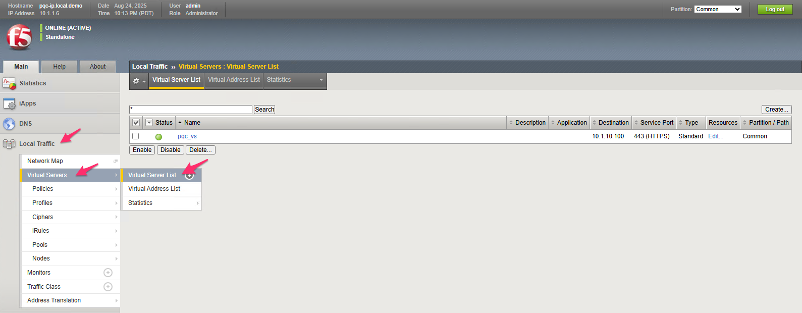

# Post-quantum Crypto (PQC) and F5

Quantum computing is one of today's most exciting technological advancements, poised to transform industries with its unparalleled processing power. Unlike classical computers, which encode data using binary bits (zeroes and ones), quantum computers leverage quantum bits, or qubits. Qubits can exist in a superposition of zero and one, meaning they can be a zero, a one, or a combination of both at the same time. This capability enables quantum computers to solve certain types of problems exponentially faster than today's classical computers.

While quantum computing won't necessarily benefit everyday tasks like web surfing, its true strength lies in addressing complex, data-intensive challenges, such as accelerating medical and pharmaceutical research, optimizing AI algorithms, improving network designs, and advancing cryptography.

F5 Post-quantum cryptography readiness: https://www.f5.com/pdf/solution-overview/f5-pqc-readiness.pdf

PQC key benefits:

Cryptography is embedded into the core of the F5® Application Delivery and Security Platform (ADSP) via the F5 BIG-IP® Traffic Management Microkernel (TMM), a foundational
element of BIG-IP solutions. 

NGINX provides PQC support using the Open Quantum Safe provider library for OpenSSL 3.x (oqs-provider). This library is available from the Open Quantum Safe (OQS) project. The oqs-provider library adds support for all post-quantum algorithms supported by the OQS project into network protocols like TLS in OpenSSL-3 reliant applications. All ciphers/algorithms provided by oqs-provider are supported by NGINX. 

- Centralizes management of cryptographic handshakes and encryption processes
- Enables crypto agility for easier adaptation to emerging cryptographic standards and strategies
- Supports quantum-resistant ciphers for both clients and servers, providing hybrid key encapsulation for robust PQC protection

Because of its pivotal role in network and application architectures—managing traffic between clients and servers—F5 ADSP is strategically positioned to facilitate and ensure PQC readiness while adapting seamlessly as encryption standards evolve.

## Lab Environment

This lab environment contains three parts. Students will perform all work from the Windows-client.

### Unless otherwise noted, you will do all work from the Windows-client ###

- BIG-IP 17.5
- NGINX Open Source Server
- Windows-client

## Windows-client

From the Windows-client, we will be able to access the BIG-IP TMUI and the websites protected with PQC profiles/OpenSSL behind both BIG-IP and NGINX.

1. Navigate to the details button of the Windows-client and connect with RDP.

> Note: To run the RDP session in "windowed" mode, choose a screen size from the drop-down list

Credentials for the Windows-client are also located on the details page

Accept the RDP certificate error if prompted

Scroll down and accept the privacy settings

Open the Chrome browser and skip the sign-in process

Set Chrome as the default browser

Set the system-level default to Chrome and close the system properties

> Note: Kyber level PQC was an early access feature in Chrome; this has been removed from the current release of Chrome. We will be using an older version to demonstrate our capabilities; please refrain from updating the Chrome browser.

### BIG-IP

BIG-IP has 17.5 installed. In 17.1, PQC for client-side SSL profiles was introduced, which we will explore in this lab. In 17.5, PQC for server-side SSL profiles was added, and both client and server-side ciphers were updated to the NIST standards at the time of publication.

> Note: We will not be doing server-side SSL PQC setup; however, the environment supports it, for exploration.

Understanding PQC Standards and Timelines: https://www.f5.com/company/blog/understanding-pqc-standards-and-timelines

1. Log in to the BIG-IP to verify access and configuration

From the Chrome browser, open the BIG-IP TMUI: https://10.1.1.6

User: admin
Password admin

2. Post-quantum crypto configuration

BIG-IP utilizes SSL Profiles for client and server-side TLS negotiations. Within the SSL Profile, attached cipher groups manage the cipher rules for negotiation.

Configuration has already been created on behalf of the lab. If you would like to configure and familiarize yourself with a new SSL profile, here is the public documentation for 17.5 and 17.5.1: https://my.f5.com/manage/s/article/K000149577

Navigate to BIG-IP cipher rules

Like the example documentation, there are two created PQC profiles, one made from the TMUI and the other from TMSH

Explore the TMSH_PQC rule, and verify the setup

Navigate to BIG-IP cipher groups

Explore the TMSH_PQC group, and verify the setup

Navigate to SSL Client profiles

Explore the TMSH_PQC client SSL profile, and verify the setup

Navigate to the BIG-IP virtual servers

Explore the pqc_vs virtual server, and verify the setup

